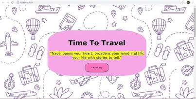
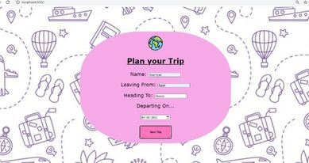
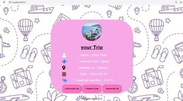

# Travel App

This project builds out a travel app that obtains a desired departure location , trip location & date from the user, and displays weather of this location and an image of the location using information obtained from three external APIs 


# Used APIs

* [Geonames](hhttp://www.geonames.org/export/web-services.html) - This was used to get the longitude, latitude, country code and country name.
* [Weatherbit](https://www.weatherbit.io/account/create) - This is used to get weather details using the longitude and latitude gotten from Geonames API.
* [Pixabay](https://pixabay.com/api/docs/) - This is used to get an image of the destination city.
  

## Run project
Below shows how to run in development and production mode.

## Run in development mode

To start the webpack dev server at port 8080
```
$ npm run build-dev
```

## Run in production mode

```
$npm run build-prod
```
```
$ npm run start
```

## Offline Functionality
The project have service workers set up in webpack to provide the offline functionality of our app.

## Testing Run
```
npm run test 
```
# Project Run Example:


# +Add a Trip

# Save Trip

# +reserve a hotel

# Save Hotel

# Remove a trip


